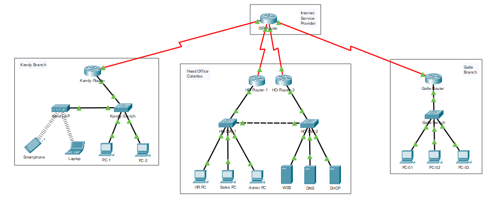

# Highly Available Enterprise Network Infrastructure Design 🌐

This project demonstrates the design and implementation of a scalable, high-availability network infrastructure for a multi-branch organization using **Cisco Packet Tracer**.

## 📌 Project Overview
The network connects a **Head Office** in Colombo with two branches:
- **Kandy Branch:** Hybrid network with Wireless connectivity.
- **Galle Branch:** Remote office connected via WAN.

## 🛠 Technologies Used
- **Routing:** OSPF (Open Shortest Path First) for dynamic routing.
- **Switching:** VLANs (802.1Q), Inter-VLAN Routing, STP.
- **High Availability:** HSRP (Hot Standby Router Protocol) for gateway redundancy.
- **Services:** DHCP, DNS, Web Server, NAT.
- **Security:** Port Security, Standard ACLs.

## 📸 Network Topology

## 📂 Files Included
1. **Highly Available Enterprise Network Infrastructure (Multi-Site).pkt**: The complete Cisco Packet Tracer simulation file.
2. **Project_Report.pdf**: Detailed documentation of the IP plan and configurations.

## 🚀 How to Run
1. Download & Install [Cisco Packet Tracer](https://www.netacad.com/courses/packet-tracer).
2. Download the `.pkt` file from this repository.
3. Open the file and observe the real-time simulation.
4. Use PING tests to verify connectivity between branches.

---
*Created by E.M.S. Ekanayake - Faculty of Technology, University of Sri Jayewardenepura*
